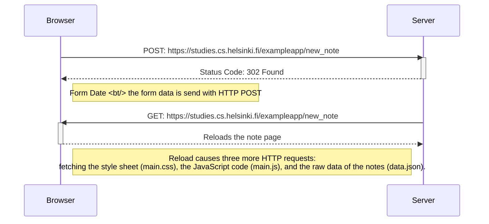

```mermaid

sequenceDiagram
    participant Browser
    participant Server

    Browser->>Server: POST: https://studies.cs.helsinki.fi/exampleapp/new_note
    activate Server
    Server-->>Browser: Status Code: 302 Found
    deactivate Server

    Note right of Browser: Form Date <bt/> the form data is send with HTTP POST

    Server->>Browser: GET: https://studies.cs.helsinki.fi/exampleapp/new_note
    activate Browser
    Browser-->>Server: Reloads the note page
    deactivate Browser

    Note right of Browser: Reload causes three more HTTP requests:<br/> fetching the style sheet (main.css), the JavaScript code (main.js), and the raw data of the notes (data.json).


```
