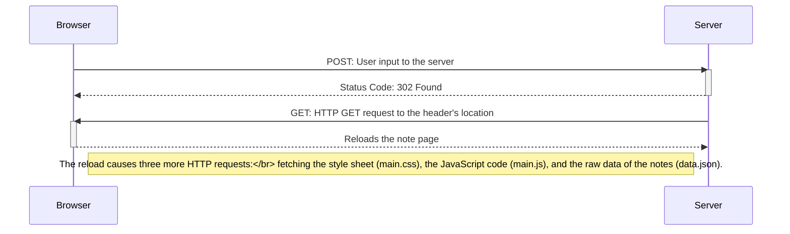

```mermaid

sequenceDiagram
    participant Browser
    participant Server

    Browser->>Server: POST: User input to the server
    activate Server
    Server-->>Browser: Status Code: 302 Found
    deactivate Server

    Server->>Browser: GET: HTTP GET request to the header's location 
    activate Browser
    Browser-->>Server: Reloads the note page
    deactivate Browser

    Note right of Browser: The reload causes three more HTTP requests:</br> fetching the style sheet (main.css), the JavaScript code (main.js), and the raw data of the notes (data.json).


```
